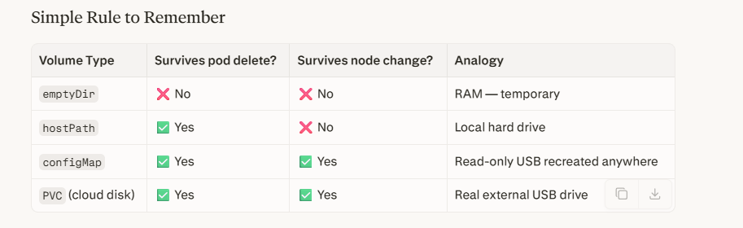
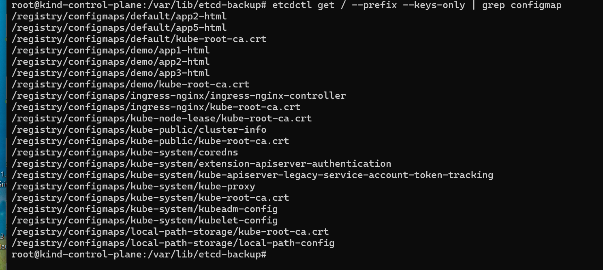
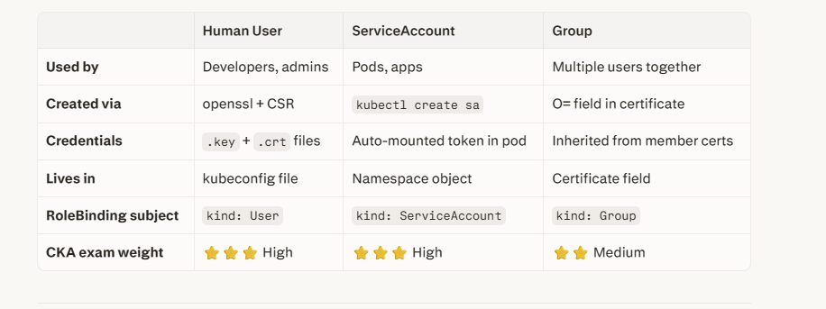
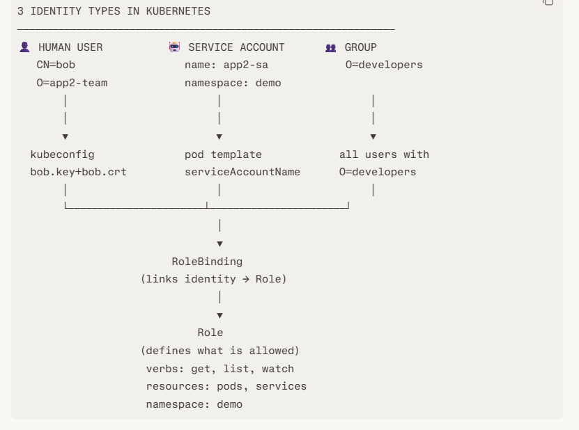

kind create cluster --config kind-config.yaml

# Option 1 — Direct via mapped host port (if you used kind-config.yaml above)
curl http://localhost:30080

# Option 2 — kubectl port-forward (works without extra port mapping)
kubectl port-forward svc/nginx-demo-svc 8080:80 -n demo
# Then open: http://localhost:8080

Full Test 

# 1. Delete everything
kind delete cluster

# 2. Recreate with correct config
kind create cluster --config kind-config.yaml

# 3. Verify nodes
kubectl get nodes

# 4. Install ingress controller
kubectl apply -f https://raw.githubusercontent.com/kubernetes/ingress-nginx/main/deploy/static/provider/kind/deploy.yaml

# Confirm pod is on control-plane
kubectl get pods -n ingress-nginx -o wide

# 5. Wait for it
kubectl wait --namespace ingress-nginx --for=condition=ready pod --selector=app.kubernetes.io/component=controller --timeout=120s

# 6. Deploy apps
kubectl apply -f multi-app.yaml
kubectl apply -f ingress.yaml

# 7. Confirm ingress has an address
kubectl get ingress -n demo

# 8. Test
curl http://localhost:8080/app1
curl http://localhost:8080/app2
curl http://localhost:8080/app3

What Actually Happens Inside the Container
nginx container default:
/usr/share/nginx/html/
    └── index.html  ← nginx's built-in default page

After volumeMount:
/usr/share/nginx/html/
    └── index.html  ← NOW replaced by YOUR ConfigMap content 🎉

The mountPath folder gets replaced/overlaid by whatever is in the volume. This is why nginx serves your custom HTML instead of the default nginx page.

Volume Types — Same Concept, Different Data Sources

volumes:
  - name: html
    configMap: ...     # data from a ConfigMap  (our example)

  - name: html
    hostPath: ...      # data from a folder on the Node

  - name: html
    persistentVolumeClaim: ...  # data from cloud disk (AWS EBS, Azure Disk)

  - name: html
    emptyDir: {}       # temporary scratch space, shared between containers

Where	Command
Login to KinD worker node ->	docker exec -it kind-worker bash
Login to control-plane	-> docker exec -it kind-control-plane bash
List all KinD nodes	-> docker ps \| grep kind

Check file from outside (no login) ->	docker exec kind-worker cat /var/lib/kubelet/pods/<uid>/volumes/kubernetes.io~configmap/html/index.html

# ETCD 

# You are already inside kind-control-plane bash

# Step 1 — enter control-plane
docker exec -it kind-control-plane bash

# Step 2 — install
apt-get update && apt-get install -y etcd-client

# Step 3 — set env vars
export ETCDCTL_API=3
export ETCDCTL_CACERT=/etc/kubernetes/pki/etcd/ca.crt
export ETCDCTL_CERT=/etc/kubernetes/pki/etcd/server.crt
export ETCDCTL_KEY=/etc/kubernetes/pki/etcd/server.key
export ETCDCTL_ENDPOINTS=https://127.0.0.1:2379

# Step 4 — now query!
etcdctl get / --prefix --keys-only | grep configmap
etcdctl get /registry/configmaps/demo/app2-html

# All commands run INSIDE kind-control-plane bash

# List everything
etcdctl get / --prefix --keys-only

# Count total keys (total objects in cluster)
etcdctl get / --prefix --keys-only | wc -l

# Get your configmap
etcdctl get /registry/configmaps/demo/app2-html

# Get a secret
etcdctl get /registry/secrets/kube-system/bootstrap-token-abcdef

# Check etcd cluster health
etcdctl endpoint health

# Check etcd member list
etcdctl member list

#ConfigMap

# 1. Edit your local HTML file
notepad ./app2/index.html

# 2. Update the ConfigMap with new content
kubectl create configmap app2-html \
  --from-file=index.html=./app2/index.html \
  --dry-run=client -o yaml | kubectl apply -f - -n demo

# 3. Restart pods to pick up new ConfigMap
kubectl rollout restart deployment/app2 -n demo

# 4. Watch rollout
kubectl rollout status deployment/app2 -n demo

ConfigMap is a snapshot of your file at creation time — it does NOT watch the file for changes. If you update index.html locally, you must re-create the ConfigMap and restart the pods to reflect changes

# Backup and restore 

before backup 
etcdctl get / --prefix --keys-only | grep configmap

# ══════════════════════════════
#  BACKUP
# ══════════════════════════════
export ETCDCTL_API=3
export ETCDCTL_CACERT=/etc/kubernetes/pki/etcd/ca.crt
export ETCDCTL_CERT=/etc/kubernetes/pki/etcd/server.crt
export ETCDCTL_KEY=/etc/kubernetes/pki/etcd/server.key
export ETCDCTL_ENDPOINTS=https://127.0.0.1:2379

etcdctl snapshot save /backup/etcd-backup.db
etcdctl snapshot status /backup/etcd-backup.db --write-out=table

# ══════════════════════════════
#  RESTORE
# ══════════════════════════════
etcdctl snapshot restore /backup/etcd-backup.db \
  --data-dir=/var/lib/etcd-restored

# Edit etcd.yaml — change data-dir + hostPath volume
vi /etc/kubernetes/manifests/etcd.yaml

# Wait for etcd pod to restart
watch crictl ps | grep etcd

 goal: 3 users, each can only access their own app in the demo namesp

 WHO wants access?          WHAT can they do?         WHERE?
─────────────────          ─────────────────         ──────
alice  ──────────────────► Role: app1-viewer ───────► demo/app1 pods,svc
bob    ──────────────────► Role: app2-viewer ───────► demo/app2 pods,svc
carol  ──────────────────► Role: app3-viewer ───────► demo/app3 pods,svc

The 4 RBAC Objects:
┌──────────────┐     ┌─────────────────┐
│     User     │     │      Role       │
│  (alice)     │     │ (app1-viewer)   │
│              │     │ rules:          │
│  Created via │     │  - get pods     │
│  certificate │     │  - get services │
└──────┬───────┘     └────────┬────────┘
       │                      │
       └──────────┬───────────┘
                  ▼
         ┌────────────────┐
         │  RoleBinding   │
         │ alice →        │
         │ app1-viewer    │
         └────────────────┘

⚠️ CRITICAL CONCEPT:
Kubernetes has NO user database.
Users are identified by X.509 certificates.
The certificate's CN (Common Name) = username
The certificate's O (Organization)  = group

To create a user:
1. Generate private key
2. Create Certificate Signing Request (CSR)
3. Kubernetes signs it → user certificate
4. Build kubeconfig with that certificate

# ── ALICE ──
openssl genrsa -out alice.key 2048
openssl req -new -key alice.key -out alice.csr -subj "/CN=alice/O=app1-team"

# ── BOB ──
openssl genrsa -out bob.key 2048
openssl req -new -key bob.key -out bob.csr -subj "/CN=bob/O=app2-team"

# ── CAROL ──
openssl genrsa -out carol.key 2048
openssl req -new -key carol.csr -out carol.csr -subj "/CN=carol/O=app3-team"

# OR on Linux/Mac inside control-plane:
cat alice.csr | base64 | tr -d '\n'
cat bob.csr   | base64 | tr -d '\n'
cat carol.csr | base64 | tr -d '\n'

kubectl apply -f csr-users.yaml

kubectl certificate approve alice
kubectl certificate approve bob
kubectl certificate approve carol

# Simpler on Linux inside control-plane:
kubectl get csr alice -o jsonpath='{.status.certificate}' | base64 -d > alice.crt
kubectl get csr bob   -o jsonpath='{.status.certificate}' | base64 -d > bob.crt
kubectl get csr carol -o jsonpath='{.status.certificate}' | base64 -d > carol.crt

kubectl --client-key=bob.key \
        --client-certificate=bob.crt \
        --server=https://127.0.0.1:52455 \
        --insecure-skip-tls-verify \
        auth whoami

kubectl apply -f rbac-roles.yaml
kubectl apply -f rbac-bindings.yaml

During CKA exam you have access to official docs.
Bookmark these NOW — they are the only pages you need for RBAC:

1. https://kubernetes.io/docs/reference/access-authn-authz/rbac/
   → Role, ClusterRole, RoleBinding, ClusterRoleBinding examples

2. https://kubernetes.io/docs/reference/access-authn-authz/certificate-signing-requests/
   → CSR YAML template (copy-paste on exam)

3. https://kubernetes.io/docs/tasks/access-application-cluster/configure-access-multiple-clusters/
   → kubeconfig setup commands

  SA 

  # Create a ServiceAccount
kubectl create serviceaccount app2-sa -n demo

# Verify
kubectl get serviceaccount app2-sa -n demo

Assign to POD 

# In your deployment YAML
apiVersion: apps/v1
kind: Deployment
metadata:
  name: app2
  namespace: demo
spec:
  template:
    spec:
      serviceAccountName: app2-sa    # ← assign SA here
      containers:
        - name: app2
          image: nginx

# Give app2-sa permission to list pods in demo
kubectl create role sa-viewer \
  --verb=get,list,watch \
  --resource=pods,configmaps -n demo

kubectl create rolebinding app2-sa-binding \
  --role=sa-viewer \
  --serviceaccount=demo:app2-sa \   # ← format: namespace:name
  -n demo

  
  

  # Troubleshooting 

   after machine restart, the kubeconfig still has kind-control-plane as server address but Docker restarted and assigned a new port

   Machine restarted:
  Docker restarted KinD containers ✅
  BUT port changed:
    Before: https://127.0.0.1:52455
    After:  https://127.0.0.1:XXXXX  (new random port)

  kubeconfig still has:
    server: https://kind-control-plane:6443  ← from merged bob/alice/carol
    Windows cannot resolve "kind-control-plane" hostname ❌

Fix 

# Step 1 — Verify Docker and KinD containers are running
docker ps | findstr kind

# Step 2 — Refresh kubeconfig with correct server address
kind export kubeconfig --name kind

# Step 3 — Test
kubectl get nodes

Permanent Fix — Add to PowerShell Profile
So you never forget to refresh after restart, add this to your PowerShell profile:

powershell
# Open PowerShell profile
notepad $PROFILE

# Add this line at the bottom:
kind export kubeconfig --name kind 2>$null